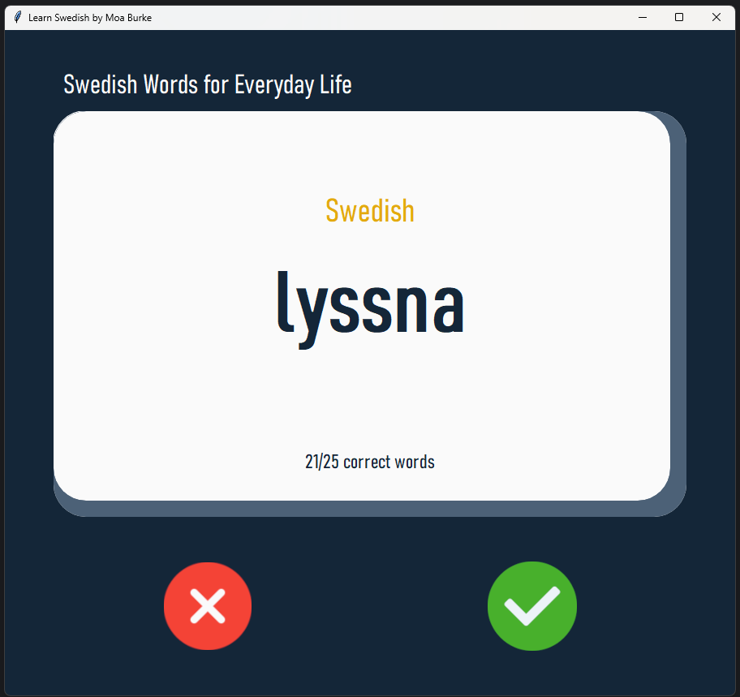
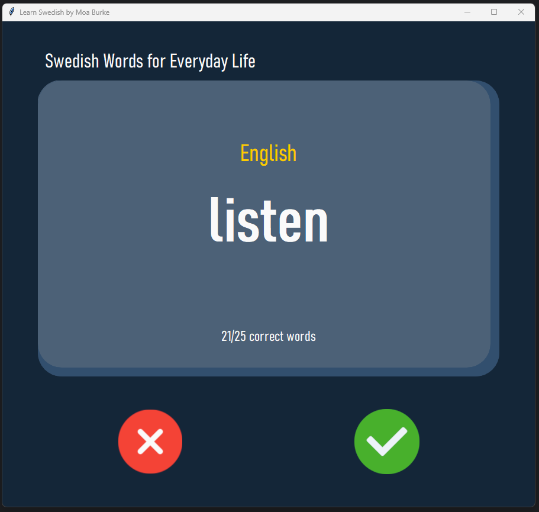
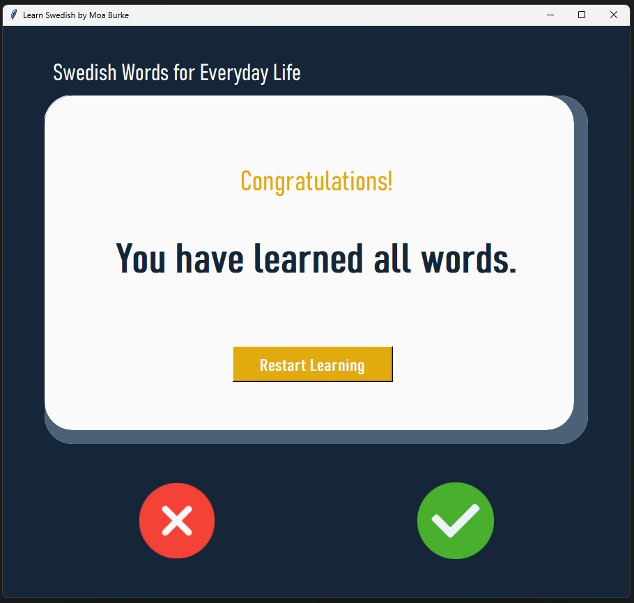

# Flash Card Learning Application

A flash card learning app built with Python and Tkinter for mastering Swedish vocabulary. Users can flip cards for translations, track progress, and save their learning in a CSV file.





A flash card learning application that allows users to:
1. Learn Swedish vocabulary by flipping cards to view both Swedish words and their English translations.
2. Track learning progress by counting total guesses and correct guesses.
3. Mark words as known to focus on unlearned vocabulary.
4. Save learning progress in a CSV file to resume later.
5. Restart the learning journey upon mastering all words.

## Features
- Displays random Swedish words with English translations on flash cards.
- Tracks and displays the count of total guesses and correct guesses.
- Allows users to mark words as known, removing them from future practice.
- Saves progress in a CSV file for easy access and continuity.
- Includes error handling for file operations to ensure smooth functionality.

## Installation

To run this project, ensure you have Python installed on your computer. You can download Python from [python.org](https://www.python.org/).

- **Note**: Tkinter is included with most Python installations. No additional installation is required for Tkinter.

1. **Clone the Repository**:
   ```bash
   git clone https://github.com/moaburke/WordFlipSwedish.git
   ```
2. **Navigate to the project directory**:
   ```bash
   cd WordFlipSwedish
   ```
3. **Install required packages**:
   ```bash
    pip install pandas
   ```


## Usage

1. **Run the Application**:
   - Execute the Python script to launch the flash card learning interface. Ensure Tkinter and any required libraries are installed.

2. **Learn Vocabulary**:
   - The application will display a random Swedish word on the front of the card. After a few seconds, the English translation will appear on the back.

3. **Mark Words as Known**:
   - Click the "✔️" button to mark the displayed word as known, which will remove it from the learning list.

4. **Track Progress**:
   - The application will show your total number of guesses and correct guesses at the bottom of the card.

5. **Restart Learning**:
   - Once all words are mastered, you can restart your learning journey by clicking the "Restart Learning" button.

## Updates

- **Version 1.0** (19 Oct 2024):
  - Initial version with core features including random word selection, card flipping, tracking of correct guesses, saving progress to a CSV file, basic error handling, and the option for users to restart their learning journey after mastering all words.

**Files**:
- Saves vocabulary data in `words_to_learn.csv` for structured storage.
- Uses `card_front.png` and `card_back.png` for card images.
